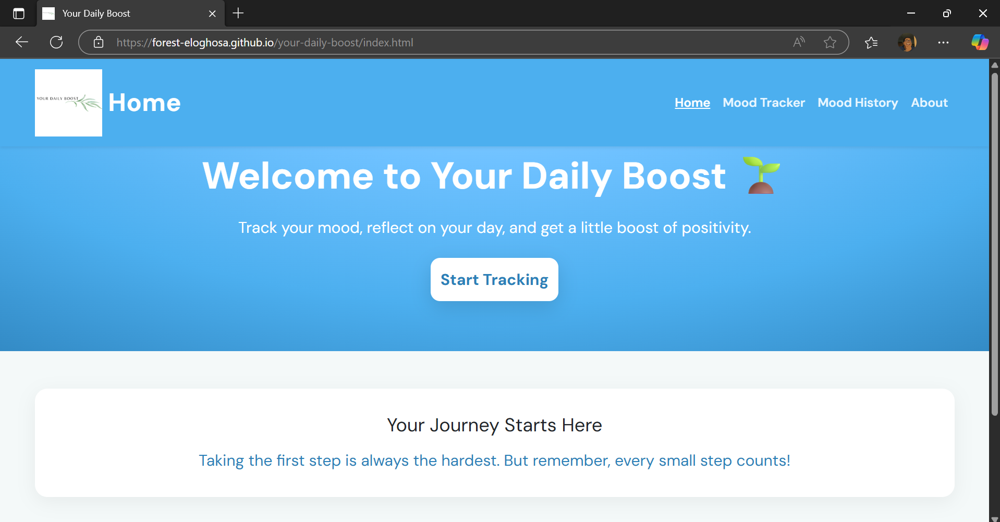
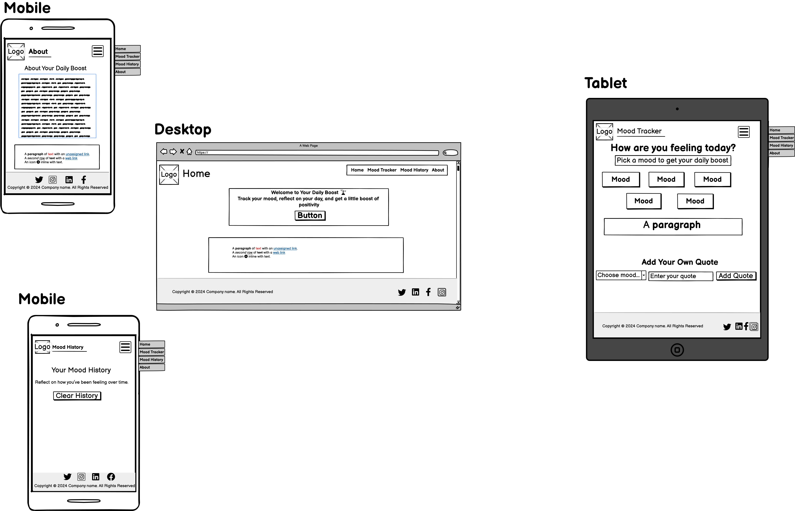
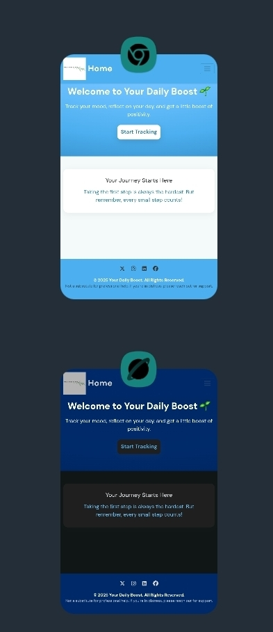
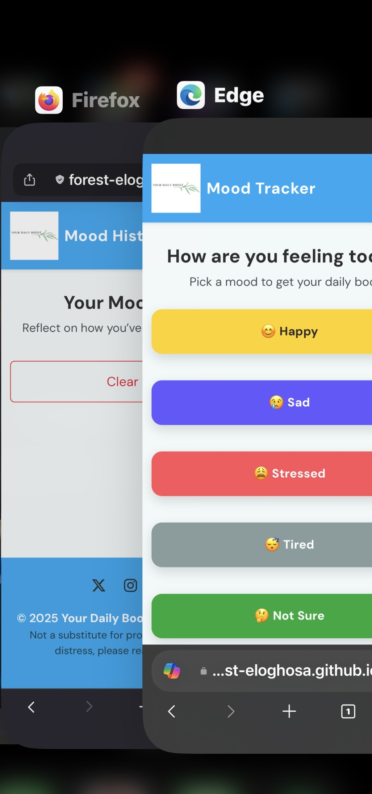
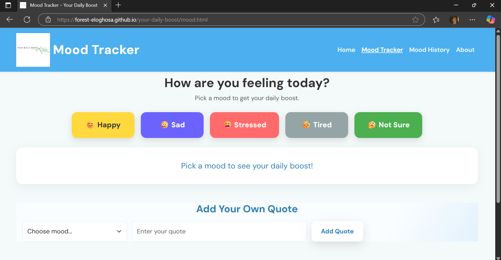

# Your Daily Boost 

## Live Site
[Visit Your Daily Boost](https://forest-eloghosa.github.io/your-daily-boost/)


---
## Description
**Your Daily Boost** is a wellness web app designed to help users reflect on their daily mood and receive uplifting quotes tailored to how they feel. Whether you’re happy, sad, tired, stressed, or simply not sure, the app offers a supportive space to pause, check in with yourself, and get a boost of encouragement and the option is there to add your own quotes too!



---
## Project Goal
Promote emotional well-being by giving users an easy, friendly way to reflect on their feelings and receive instant support in the form of uplifting quotes.  
> This tool does not replace professional mental health care.

---

### User Stories
**As a first-time user, I want:**
- To quickly understand what the app does.

- To easily choose my current mood.

- To receive a supportive message instantly.

**As a returning user, I want:**
- To pick different moods on different days.

- To see a variety of motivational quotes.

- To feel encouraged and supported consistently.

**As a user with limited technical knowledge, I want:**
- A clear, accessible interface.

- Simple navigation and controls.

- Responsive design that works on my phone and tablet.

---

# Features and Design
## Key Features
1. **Mood Selection**  
   Five moods: **Happy, Sad, Tired, Stressed, Not Sure** (color-coded).  
   Selecting a mood saves it to local history and shows a tailored motivational quote.

2. **Dynamic Quote Display**  
   Personalized quotes appear instantly; users can also **add custom quotes** by mood.

3. **Responsive Design**  
   Built with **Bootstrap 5** + custom CSS. Fully responsive and mobile-friendly.

4. **Mood History**  
   Saved entries are displayed as **cards** with mood badges, date, and quote. History can be **cleared**.

5. **Polished UI**  
   - Fixed-top navbar with logo  
   - Gradient hero section  
   - Styled footer with social links  
   - Toast-style feedback messages (instead of intrusive alert boxes)

6. **Custom 404 Error Page**  
   Users who visit a non-existent page are shown a friendly 404 error screen with a prominent button to return to the homepage, ensuring smooth navigation and a consistent user experience.

##  Design
- **Colors:** Calm, uplifting palette with distinct mood colors.  
- **Fonts:** DM Sans + Arbutus Slab for friendly readability.  
- **Layout:** Focused center content, cards for history, clear hierarchy.  
- **Accessibility:** Semantic HTML, aria-labels on controls, color contrast considered.

## Key Enhancements in JavaScript

- **Mood normalization** prevents typos and mismatches when users input moods.
- **Toast feedback** uses Bootstrap styling (but still works without).
- **History rendering** supports both grid and list layouts for flexibility.
- **Expanded quotes library**:  
  - Happy 😊 → 8 quotes  
  - Sad 😢 → 8 quotes  
  - Tired 😴 → 8 quotes  
  - Stressed 😰 → 8 quotes  
  - Unsure 🤔 → 8 quotes  
- **No breaking changes** — HTML and CSS work exactly as expected.


## Wireframes

Initial wireframes were created and includes adaptive layout and padding for:

- Mobile
- Tablet
- Desktop



#### Wireframes were created using [balsamiq](https://balsamiq.com/)

---

## Project Structure
```
/your-daily-boost
├── assets/
│ ├── css/
│ │ └── style.css
│ ├── favicon
│ │ ├── favicon.ico
│ │ ├── favicon-16x16.png
│ │ ├── favicon-32x32.png
│ │ ├── site.webmanifest
│ │ ├── apple-touch-icon.png
│ │ ├── android-chrome-192x192.png
│ │ ├── android-chrome-512x512.png
│ ├── images
│ │ ├── logo-image1.png
│ │ ├── logo-image2.png
│ │ ├── Your-Daily-Boost-Wireframes
│ ├── js/
│ │ └── script.js
│ ├── testing/
│ │ ├── multiple_site_testing
│ │ │   ├── table-dark-theme-about-page.png
│ │ │   ├── table-dark-theme-home-page.png
│ │ │   ├── table-dark-theme-mood-history-page.png
│ │ │   ├── table-dark-theme-mood-tracker-page.png
│ │ │   ├── table-light-theme-about-page.png
│ │ │   ├── table-light-theme-home-page.png
│ │ │   ├── table-light-theme-mood-history-page.png
│ │ │   ├── table-light-theme-mood-tracker-page.png
│ │ │   ├── tested-on-desktop-chrome.png
│ │ │   ├── tested-on-desktop-edge.png
│ │ │   ├── tested-on-desktop-edge2.png
│ │ │   ├── tested-on-firefox-and-edge.png
│ │ │   ├── tested-on-safari-and-chrome.png
│ │ │   ├── tested-on-tablet-chrome-and-internet-browser.png
│ │ ├── CSS-Validator-No-Error.png
│ │ ├── HTML-Validator-Error-found-Mood-Page.png
│ │ ├── HTML-Validator-Home-Page.png
│ │ ├── HTML-Validator-No-Error-About-Page.png
│ │ ├── HTML-Validator-No-Error-Mood-Page.png
│ │ ├── JavaScript-Validation-No-Error.png
│ │ ├── Light-house-Scan-About-page.png
│ │ ├── Light-house-Scan-Mood-History-page.png
│ │ ├── Light-house-Scan-Mood-page.png
│ │ ├── Light-house-Scan-home-page.png
├── about.html
├── history.html
├── index.html
├── mood.html
└── README.md
├── TESTING.md
```

---

## Technologies Used
- **HTML5** – semantic structure.  
- **CSS3** – custom styling and responsive design.  
- **Bootstrap 5** – responsive grid and components (CSS + JS bundle for navbar).  
- **JavaScript** – interactivity and mood/quote logic, localStorage, toasts.  
- **Canva** – logo design.  
- **favicon.io** – favicon generator.
- **Balsamiq** – wireframing tool.
- **GitHub Pages** – Project deployment.

---

## Testing  

_This project was tested for functionality, responsiveness, accessibility, and browser compatibility._  
All major features such as mood selection, custom quotes, history saving, and navigation were confirmed to be working as intended.  

**For full testing documentation, including detailed tables, device results, bug fixes, and validator scans, see [TESTING.md](TESTING.md).**  

- **Functionality:** Mood buttons, custom quotes, history, and clear history all work as expected.  
- **Responsiveness:** Tested on multiple devices (mobile, tablet, desktop) with consistent layout and scaling.  
- **Accessibility:** Semantic HTML, aria-labels, focus states, and contrast checks were implemented.  
- **Browser Compatibility:** Confirmed working on Chrome, Safari, Samsung Internet Browser, and Edge.  

### Device Testing Images  

  

  

  

---

## Validators  

All project code was validated against modern standards:  

- **HTML:** Passed [W3C Validator](https://validator.w3.org/) after resolving initial issues.  
- **CSS:** Passed [W3C CSS Validator](https://jigsaw.w3.org/css-validator/) with no errors.  
- **JavaScript:** Checked using [JSHint](https://jshint.com/); no significant issues detected.  
- **Lighthouse:** Chrome DevTools audit scored 100 for Performance, Accessibility, Best Practices, and SEO.  

See [TESTING.md](TESTING.md) for full validator screenshots and detailed results.  

---

## Deployment

### GitHub Deployment Steps

1. Fork the repository or clone using:

```bash
git clone 
```

2. Navigate into the folder:

```bash
cd Your-Daily-Boost
```

3. Make changes and push them:

```bash
git add .
git commit -m "Your message"
git push origin main
```

4. Enable GitHub Pages in repo Settings → Pages → Source → main → /root

**Live Site:** *(https://forest-eloghosa.github.io/your-daily-boost/)*


---
## Credits 

### Resources
- **Logo:** Designed logo image in [Canva](https://www.canva.com/)

- **Favicon:** Generated logo via [favicon.io](https://favicon.io/favicon-converter/)

- **Quotes:** Sourced from various online sources  and personal contributions.

- Key insights from [Designveloper](https://www.designveloper.com/guide/web-application-development/) on web app development.

- **Fonts:** Used Google Fonts - [DM Sans](https://fonts.google.com/specimen/DM+Sans), [Arbutus Slab](https://fonts.google.com/specimen/Arbutus+Slab)

---
### Code
- Code to make labels visually hidden was taken from [byu1kim/notes](https://github.com/byu1kim/notes/tree/840c073d2f3a86b6bc70bbe159d37dca31019de3/content/Frontend/HTML.md)

- General structure and usage of the **Bootstrap 5 Navbar** and **Toast component** were based on examples from the [Bootstrap Documentation](https://getbootstrap.com/docs/5.0/components/navbar/) and [Bootstrap Toasts](https://getbootstrap.com/docs/5.0/components/toasts/). These were customized heavily for this project.

- Form validation approach (preventing special characters in the quote form) was inspired by standard regex validation patterns documented on [MDN Web Docs](https://developer.mozilla.org/en-US/docs/Web/JavaScript/Guide/Regular_Expressions).

- Accessibility enhancements such as the **Skip Link pattern** and `:focus-visible` usage were adapted from accessibility best practices described by [W3C Web Accessibility Initiative](https://www.w3.org/WAI/).

- The approach for working with localStorage and event delegation in my JavaScript code was guided by the tutorial [How LocalStorage and Event Delegation work](https://youtu.be/YL1F4dCUlLc?si=2arAGwdS2fBd6jDl&t=864) on YouTube.

- Any other code not credited above was written originally by the developer.

---
### Acknowledgements

- Thanks to [Code Institute](https://codeinstitute.net/) for their guidance and support throughout the project and unlimited resources of information.
---

## Developer, Disclaimer and Feedback

### Developer

Project by [Forest Eloghosa](https://forest-eloghosa.github.io/portfolio/)

---

## Disclaimer
 This project is for educational purposes only and does not replace professional mental health care. If you are experiencing emotional distress, please seek help from a qualified mental health professional.

---
## Feedback
Feedback is welcome! Please reach out via 
- [LinkedIn](https://www.linkedin.com/in/forest-e-b16ab81ba)

- [GitHub](https://github.com/Forest-Eloghosa)


