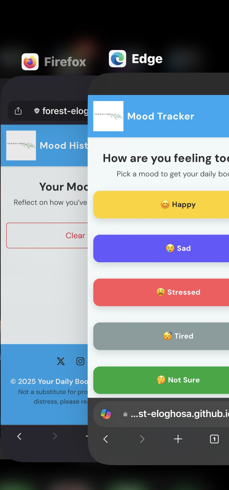

# Your Daily Boost – Testing Documentation  

## Table of Contents
- [Overview](#overview)  
- [Testing Strategy](#testing-strategy)  
- [Functionality Testing](#functionality-testing)  
- [Responsiveness Testing](#responsiveness-testing)
- [Device Testing Images](#device-testing-images)  
- [Accessibility Testing](#accessibility-testing)  
- [Browser Compatibility](#browser-compatibility)  
- [Validators](#validators)  
- [Bug Fixes & Improvements](#bug-fixes--improvements)  
- [Lighthouse Results](#lighthouse-results)  
- [Summary](#summary)  

---

## Overview
The goal of testing was to ensure that the **Your Daily Boost** web app:  
- Works correctly across devices and browsers  
- Is responsive and accessible  
- Meets semantic and modern coding standards  
- Provides a calm, inclusive, and technically sound user experience  

---

## Testing Strategy
- **Manual Testing:** Step-by-step feature checks against user stories.  
- **Cross-Browser Testing:** Chrome, Edge, Firefox.  
- **Device Testing:** iPhone, Samsung tablet, Windows desktop, Android.  
- **Automated Validation:** HTML, CSS, JavaScript, Lighthouse.  
- **Bug Tracking:** Documented issues, fixes, and retesting.  

---

## Functionality Testing  

| Feature | Test Case | Result |
|---------|-----------|--------|
| **Footer Social Icons** | Clicking icons opens correct external pages in new tab | Fully functional | 
| **Navbar** | Navbar collapses into toggler on mobile, expands on desktop |  Works at all breakpoints | 
| **Mood Buttons** | Selecting a mood saves it and displays a tailored quote |  Functional | 
| **Custom Quote Form** | Submits new quote, validates fields, saves without duplicates |  Functional | 
| **Mood History** | Displays cards with mood, date, and quote |  Functional | 
| **Clear History** | Clears saved mood history |  Functional | 
| **Toast Notifications** | Show confirmation for actions (quote added, history cleared) |  Functional | 
| **Hero Section** | Displays correctly on all devices with centered text |  Functional | 

---

## Responsiveness Testing  

### Devices Tested
- iPhone (Safari, Firefox, Edge & Chrome)

- Samsung Tab (Chrome & Internet Browser)

- Windows Desktop (Chrome & Edge)    

### Results
- All content adapted well on each screen size

- Navbar and modal worked correctly at all breakpoints

- Layout remained consistent and readable

### Responsiveness Testing Updates
- **iPhone (Safari, Firefox, Edge & Chrome):** All sections scale correctly and behave as expected
- **Samsung (Chrome & Internet Browser):** Pages remain responsive
- **Windows (Chrome & Edge):** Layout displays correctly

## Device Testing Images

 

 

 

 

 

 

 

 

 

 

 

 

 

---

## Accessibility Testing  

- Semantic HTML tags used across all pages  
- **aria-labels** applied to buttons and form fields  
- Images contain descriptive `alt` text  
- Focus states are visible on interactive elements  
- Color palette checked for contrast compliance  
---

## Browser Compatibility  

Tested on latest versions of:  
-  Chrome   
-  Edge   
-  Safari
-  Firefox

No critical issues found.  

---

## Validators  

### HTML
- Validated with [W3C Markup Validation Service](https://validator.w3.org/)  
- All pages passed after fixes  

")

")

---

### CSS
- Validated with [W3C CSS Validator](https://jigsaw.w3.org/css-validator/)  
-  No errors   

---

### JavaScript
- Validated with [JSHint](https://jshint.com/)

-  No critical issues; unused variable removed 

- Added `/* jshint esversion: 6 */`  

  

---

### Lighthouse
- Performed audit in Chrome DevTools

- Scores: **100** across Performance, Accessibility, Best Practices, and SEO  

---

## Bug Fixes & Improvements  

1. **Navbar Overlap & Toggler Not Working**  
   - Fixed by standardizing Bootstrap navbar and including JS bundle.  

2. **Hero/Text Misalignment on Small Screens**  
   - Added `.section-padding-top` for fixed navbar spacing.  

3. **Mood Buttons Stacking Incorrectly**  
- **Cause:** Mixed custom CSS and Bootstrap grid inconsistencies. 
- **Fix:** Standardized layout using Custom CSS grid with media queries for responsiveness.

4. **Quotes Repeating / Not Updating**
   - **Cause:** `Math.random()` returned the same index multiple times, and the DOM update logic wasn’t resetting.
   - **Fix:** Implemented a **Fisher–Yates shuffle** per session. Quotes are now randomized at load, and each mood cycles through all quotes before repeating.  

5. Quote persistence
**Problem:** When a new quote is added with addQuote(), it updates quotes object in memory, but it doesn’t save to localStorage. Meaning: if i refresh the page, the new quote disappears.

**Fix:** updated code to save quotes to localStorage:localStorage.setItem("quotes", JSON.stringify(quotes));
       And when the page loads, restore it:
const savedQuotes = JSON.parse(localStorage.getItem("quotes"));
if (savedQuotes) {
  Object.assign(quotes, savedQuotes);
}

6. Toast UX, No Alerts
**Improvement:** Replaced intrusive `alert()` calls with a small toast. If an element with `id="toast"` exists, it’s used; otherwise a minimal fallback toast is rendered.

7. **JavaScript Reference Error (`clearMoods`)**
   - Removed unused `window.saveMood` / `window.clearMoods` lines.

8. **Mood History Not Rendering on Mood Page**
   - **Cause:** `renderHistory()` only called on index page.
   - **Fix:** Added call to `renderHistory()` on `mood.html` and ensured container exists with proper ID.

9. Quote–History Mismatch
**Problem:** The quote shown when a user clicked a mood sometimes differed from what was saved to history.
**Cause:** History rendering occasionally replaced missing quotes with a *new* random quote.  
**Fix:** The renderer now always shows the **exact** quote that was saved with the entry. No random substitution occurs in history.

10. Robust Quote Library Merge
**Problem:** User-added quotes could produce duplicates or fail to merge reliably.
**Fix:** On load, the app merges quotes from `localStorage` into the default library with **Set-based de-duplication**, then shuffles.

11. Defensive Mood Handling
**Problem:** Variants like `Not Sure`, `not-sure`, `not_sure` caused key mismatches.
**Fix:** Added a `normalizeMood()` helper (lowercase, remove non-letters, special-case `not sure` → `notsure`).

12. The “Clear moods” code runs immediately
**Problem:** Right now, because the block is outside a function the code runs as soon as the script loads, clearing the history immediately:
**Fix:** wrapped the function, referenced site-click a mood button which saved to history.

13. **Improved Code Comments and Structure**
   - Added detailed comments for clarity.
   - Grouped related functions together.

14. Positioning of Footer Icons
**Problem:** Footer icons shifting positions
**Fix:** Footer icons aligned with custom CSS styling for consistent placement.

---

## Lighthouse Results  

- **Performance:** 100  
- **Accessibility:** 96  
- **Best Practices:** 100  
- **SEO:** 100  

(See screenshots above for detailed reports.)  

---

## Summary
The project has been tested extensively across:  
- Multiple devices, screen sizes, and browsers  
- Code validators and Lighthouse scans  
- Accessibility and responsiveness checks  

 All bugs were identified, fixed, and revalidated.  
 User stories were cross-checked and met.

 _The final product is a calm, inclusive, and technically sound platform for emotional reflection - accessible, responsive, and user-centered experience._

The site is now **stable, inclusive, and production-ready**.